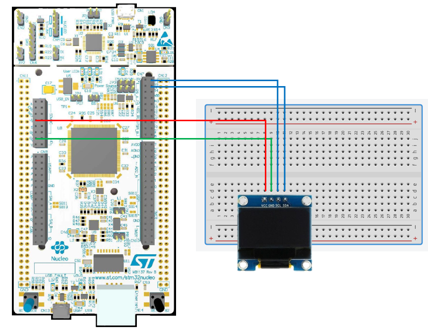

# STM32 Project - OLED 顯示

這是一個用於 STM32F4 系列微控制器的示例項目，旨在讓 OLED 顯示資料。

## 硬件要求

- STM32F429ZIT6 微控制器
- OLED 0.96 I2C

## 軟件依賴

- STM32CubeIDE

## 學習目標

- 使用 I2C，讓 OLED 顯示資料

## 電路圖

## 構建和編譯

1. 將資料夾放入 STM32CubeIDE 的 WorkSpace 中
2. 在 STM32CubeIDE 中打開 .cproject
3. 編譯並燒寫至您的微控制器

## 使用方法

將編譯好的程序燒寫到 STM32 微控制器後，OLED 應該會顯示資料。

## 功能介紹

- OLED_ShowString：顯示字串
- OLED_DrawLine：畫出一條線
- OLED_ShowNum：顯示 int
- OLED_ShowSignedNum：顯示 unsigned int

## STM32 設定提示

- I2C 要使用 Fast Mode
- 目前設定為 I2C1，如要使用 I2C2, I2C3...，需修改 OLED.c 第 26 行和第 163 行
